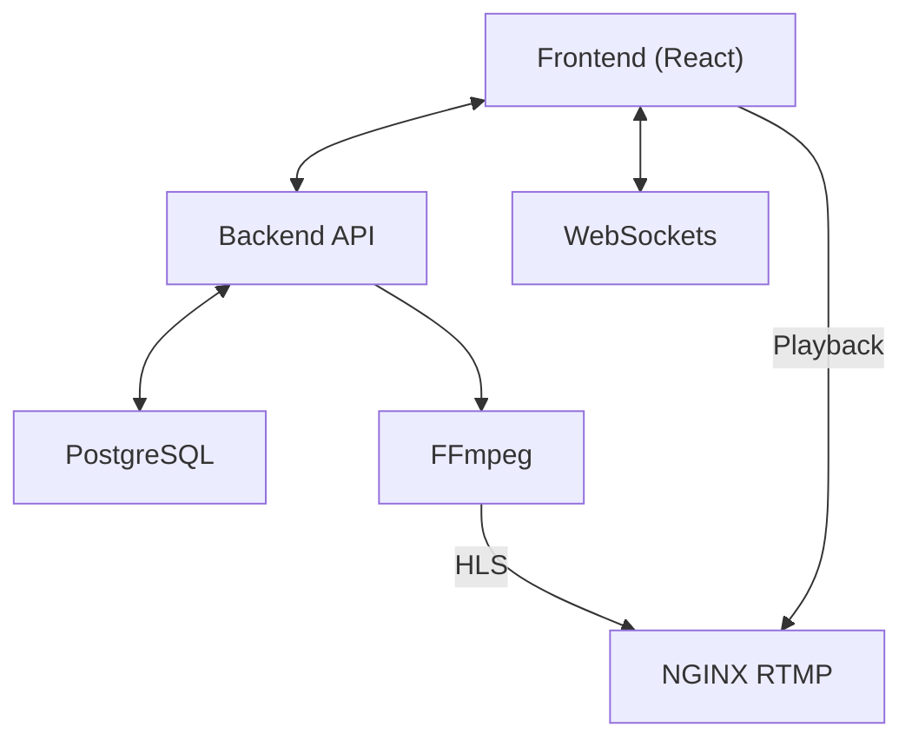

# KurdLogs Core 📺


A lightweight, modern, self-hosted IPTV management panel for restreaming, transcoding, and 24/7 automated TV channels.

## Features

- **Modern Dashboard**: Dark theme, glassmorphism UI with live stream previews and stats.
- **Channel Management**: Support for M3U8, MP4, RTMP, MPEG-TS, SRT, UDP, HTTP.
- **24/7 Playlists**: Drag-and-drop scheduling for automated channels.
- **Live Transcoding**: Adaptive HLS (1080p, 720p, 480p) via FFmpeg.
- **Overlays**: Add logos, scrolling text, LIVE badges, and watermarks dynamically.
- **Tokenized Streams**: Secure HLS URLs with auto-refreshing tokens.
- **Monitoring**: Real-time CPU, RAM, bitrate, and FPS tracking via WebSockets.
- **Auto-Reconnect**: Automatically restart streams on crash or source failure.

## Architecture



## Quick Start (Docker)

1. Clone the repository
2. Run the installation script:
```bash
sudo ./install.sh
```

## Environment Variables

| Variable | Description | Default |
|---|---|---|
| `JWT_SECRET` | Secret key for auth | (random) |
| `DATABASE_URL` | Postgres connection string | `postgresql://...` |
| `FFMPEG_PATH` | Path to FFmpeg executable | `ffmpeg` |
| `STREAMS_DIR` | Output directory for HLS | `/var/streams` |

## Default Credentials
- **User:** `admin`
- **Pass:** `admin123`

## License
MIT
