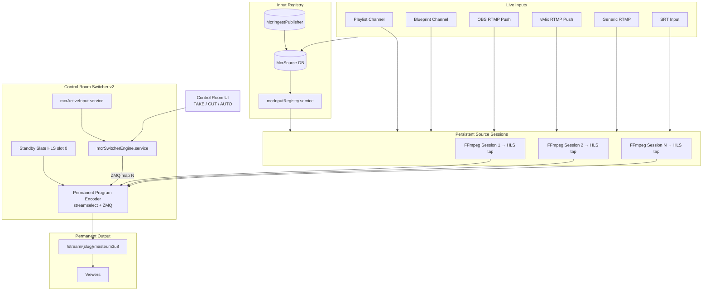

# MCR v2 — Broadcast Switcher Architecture

## Overview

MCR v2 replaces the three-tier RTMP bus relay model with a **permanent program switcher encoder** that reads all source session HLS taps in parallel and switches active input via FFmpeg **streamselect + ZMQ** — no encoder restart, no nginx bus relay, no ffprobe gates on TAKE/CUT/AUTO.

## Architecture Diagram



## Switching Flow (OBS-style)

| Action | What changes | What does NOT change |
|--------|--------------|----------------------|
| **Preview** | `previewSourceId` in DB | Encoder, HLS output, viewer URL |
| **TAKE** | ZMQ `map` index + program/preview swap in DB | Encoder process, HLS segments path |
| **CUT** | ZMQ `map` index + program source in DB | Encoder process, HLS segments path |
| **AUTO** | ZMQ `map` index + automation source in DB | Encoder process, HLS segments path |

## Core Services (new)

| File | Role |
|------|------|
| `backend/src/services/mcr/mcrInputRegistry.service.ts` | Input Registry — McrSource → session HLS paths |
| `backend/src/services/mcr/mcrActiveInput.service.ts` | Active Input Manager — preview/program slots in DB |
| `backend/src/services/mcr/mcrProgramEncoder.service.ts` | Permanent Program Encoder — multi-input FFmpeg + HLS |
| `backend/src/services/mcr/mcrSwitcherEngine.service.ts` | Switcher Engine — TAKE/CUT/AUTO via ZMQ only |
| `backend/src/services/mcr/mcrSlate.service.ts` | Standby black HLS (input slot 0) |
| `backend/src/services/mcr/mcrZmqClient.ts` | ZMQ command sender for streamselect |
| `backend/src/services/mcr/mcrSwitcherUrl.ts` | Internal source URL marker |

## Database Changes

`McrRouterState` additions:

- `switcherEncoderPid` — permanent encoder PID
- `switcherZmqPort` — ZMQ control port per channel
- `programInputSlot` / `previewInputSlot` — active slot indices
- `architectureVersion` — `v2-switcher` (default)

Run: `npx prisma db push` in `backend/`

## API Changes

**No breaking API changes.** All existing Control Room endpoints unchanged:

- `POST /api/mcr/:channelId/take`
- `POST /api/mcr/:channelId/cut`
- `POST /api/mcr/:channelId/auto`
- `POST /api/mcr/:channelId/preview`

Snapshot adds optional fields: `switcherRunning`, `architectureVersion`.

## Frontend Changes

**None required.** Control Room UI (`ControlRoomPage.tsx`) unchanged. Optional: display `architectureVersion` in debug panel.

## Migration from v1 Bus Architecture

1. Set `MCR_ARCHITECTURE=v2-switcher` (default in `env.ts`)
2. Run `prisma db push`
3. Rebuild and deploy backend
4. For each MCR channel: **Stop → Enable MCR / Init** once
5. Rollback: set `MCR_ARCHITECTURE=v1-bus` and restart backend

v1 services (`mcrRelay`, `mcrBusHolder`, `mcrBinding` ffprobe gates) remain in codebase but are bypassed when v2 is active.

## Files Modified

- `backend/prisma/schema.prisma`
- `backend/src/config/env.ts`
- `backend/src/services/sourceRouter.service.ts`
- `backend/src/services/ffmpeg.service.ts`
- `backend/src/types/index.ts`
- `backend/src/index.ts`

## Implementation Roadmap

| Phase | Status | Scope |
|-------|--------|-------|
| **Phase 1** | ✅ Done | Permanent encoder, ZMQ instant switch, input registry |
| **Phase 2** | Planned | FADE crossfade via filter graph (no restart) |
| **Phase 3** | Planned | Hot-add inputs without encoder rebuild |
| **Phase 4** | Planned | SRT direct ingest slots |
| **Phase 5** | Planned | Remove v1 bus relay code entirely |

## Risks & Compatibility

| Risk | Mitigation |
|------|------------|
| HLS input latency vs RTMP | Sessions already produce low-latency HLS taps; switch is sub-second |
| Encoder rebuild when sources added | Only on source list change, not on switch |
| ZMQ port collision | Port derived from channel UUID hash (15550–25549) |
| Codec mismatch between sessions | Sessions normalize to h264/aac; program encoder re-encodes with veryfast |
| Overlays on MCR output | Still requires transcode path — not yet wired to v2 switcher |

## Success Criteria Mapping

| Requirement | v2 Implementation |
|-------------|---------------------|
| Permanent encoder | `mcrProgramEncoder.service` — one FFmpeg per MCR channel |
| Permanent HLS output | Fixed `/var/streams/{slug}/720p/` path |
| Viewer URL never changes | Same `master.m3u8` URL |
| Switch without FFmpeg restart | ZMQ `streamselect` map change |
| No RTMP relay on switch | Bus relay bypassed entirely |
| No ffprobe on switch | No nginx stat / ffprobe in switch path |
| TAKE/CUT/AUTO UI unchanged | Same API + `sourceRouter.service` handlers |

## Environment

```env
MCR_ARCHITECTURE=v2-switcher   # default; use v1-bus for legacy
```
